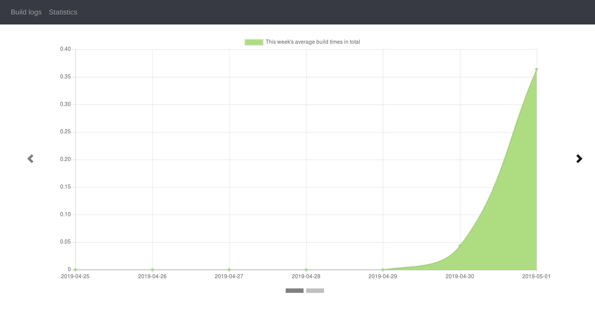
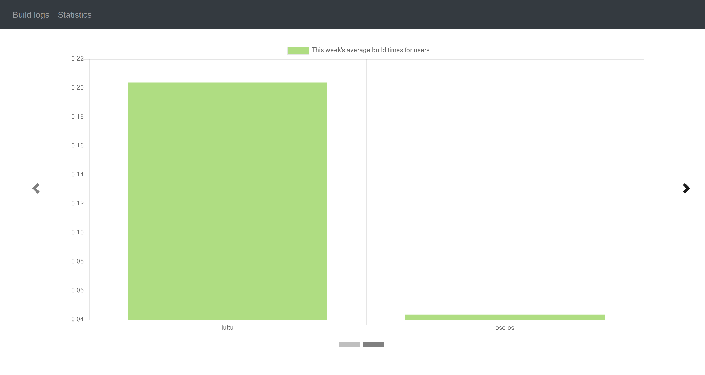
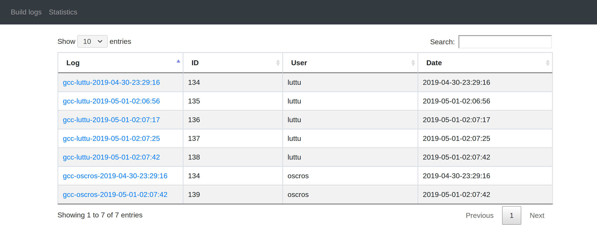
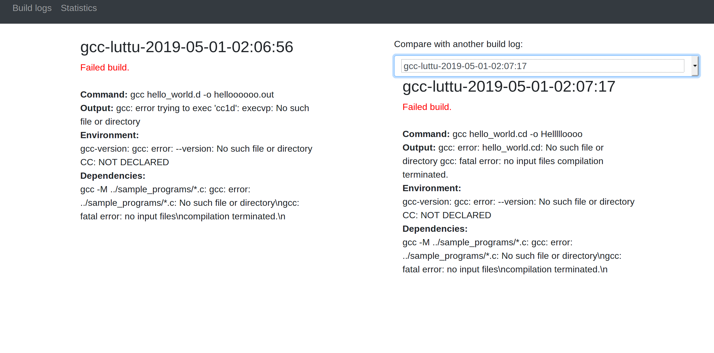

# bscan

## Lightweight build scan tool
### Authors
- Johan Luttu, luttu@kth.se
- Oscar Rosquist, oscarros@kth.se
### Description
bscan is a lightweight build scan tool/build wrapper that captures the data about your builds and creates a link to a report about the build that can be displayed on a website. This can be useful if one is having problems with a build and want to request help from a colleague. The build scan link can then be easily shared which allows the colleague to quickly see everything about the build that's relevant, such as the build command, stack trace/output, environment, dependencies, etc.

We're inspired by the [build scans](https://gradle.com/build-scans/) that Gradle enterprise supports and we intend to create something similar that's not only for gradle. The wrapper is currently limited to gcc. It'll capture the command, environment variables, dependencies and the gcc output. It will also serve as a build time logging tool where you can see the average build times, visualized as charts. This can provide valuable insights. Every build scan will be pushed to a Node.js web server which stores them in its file system. Vue and bootstrap is used for front-end.










### NOTICE
There's no logic implemented for authenticating the requests to the server. If you don't want to risk receiving bad requests, make your server inaccessible from outside your network.

### Installation 

#### Requirements 
The following are required to be able to run this project
* [python 3.7](https://www.python.org/downloads/)
* [node](https://nodejs.org/en/)
* [pip](https://pypi.org/project/pip/)

To install all dependencies, run the following in the root directory of the project:
```
./install.sh
```

### How to use

#### Server
To start server, run from root directory in the project:  
```
cd server/ && npm start 
```

#### bscan build wrapper
The build scan wrapper is meant to be used in conjunction with another command. Example:
```
bscan gcc hello_world.c -o hello_world.out
```
Running this command will by default push a json object containing:
* the date/time
* user (return by the command "whoami")
* the environment variable CC if it is set
* the version of gcc on the machine
* the dependencies (returned by the command "gcc -M ../sample_programs/*.c")
* the command passed to the wrapper and the output of it
* the time the command took in seconds
So by default the wrapper is focused on C compilation and environment related to that. 

The wrapper can however be configured using the bscan_config.json found in the folder 'build_wrapper'. In it you can configure: 
* which endpoint the api is hosted on
* which environment variables you want to push
* which command to fetch dependencies you want to run. 

The config file needs to be in the same folder as the running of bscan takes place in. 
Otherwise the bscan will default to using the following config:
```json
{
    "api_endpoint": "http://localhost:8989/api/buildLog/add",
    "env-variables": [
        "CC"
    ],
    "versions": [
        "gcc",
    ],
    "dependency-commands": [
        "gcc -M ../sample_programs/*.c"
    ]
}
```

Once the bscan wrapper has pushed the json object, it should respond with a url to the log of the command. 
